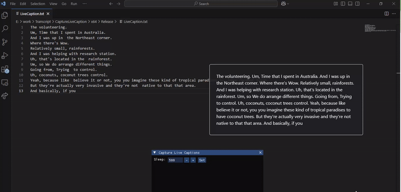

# Real-Time Chrome Live Caption Saver (2025 Edition)

A powerful **C++** application that captures **Chrome Live Captions** and converts them to **text in real-time**. Perfect for improving accessibility, saving transcripts, or analyzing spoken content from videos—especially useful for job interviews or conversations with GPT-powered AI tools. 

## 🎯 Features

- **Real-time Text Capture**: Instantly converts Chrome Live Captions into plain text.
- **Multi-Language Support**: Works with captions in various languages for a global audience.
- **Ideal for Interviews**: Use this tool to capture captions from job interviews conducted via platforms with GPT integration or AI-driven communication.
- **Save or Copy Transcripts**: Easily store captioned text as files or copy it to your clipboard.
- **Efficient & Lightweight**: Optimized with C++ for high performance and fast text extraction.

## 🚀 How It Works

1. Ensure **Live Captions** are enabled in Chrome.
2. Run the C++ app to capture captions from media in Chrome, including GPT-powered interviews.
3. The app automatically processes the captions and displays them as text in real-time.
4. Optionally, save the text or copy it for further use!

## 💡 Use Cases

- **Job Interviews**: Capture real-time captions from AI-assisted interviews with GPT or other platforms, making it easier to review and follow up on questions.
- **Content Creators**: Quickly save captions from online videos for script writing or analysis.
- **Accessibility**: Enhance accessibility by converting captions into text for users who need text-based content.
- **Language Learners**: Capture and review spoken content to aid in language transcription and learning.
- **Developers & Researchers**: Use captured text for speech-to-text projects or natural language processing (NLP) experiments.

## 🔧 Technologies Used

- **C++**: Core language used for high-performance real-time text capture.
- **Chrome API**: To capture Chrome's Live Captions data.

## 📞 Contact

Feel free to reach out if you have any questions or want to contribute!

Telegram: [@bypassy](https://t.me/bypassy)

Discord: bypassy

Whatsapp: +44 7767328564

Skype: live:.cid.258b728263fb7085

## 🛠️ Contributing

Contributions are welcome! Fork this repository, create a new branch, and submit a pull request.

## 📝 License

This project is licensed under the MIT License.

## 🌐 Keywords

**C++**, **Chrome Live Caption**, **Real-time Text Capture**, **Job Interviews**, **GPT**, **Speech-to-Text**, **Chrome API**, **Accessibility**, **Multi-Language Support**
